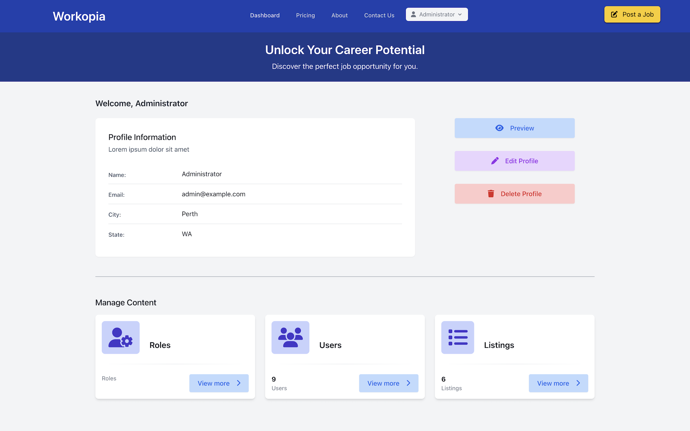

# Workopia in Laravel 11

### Assessment Task 2: Portfolio Pt. 2

---

#### Built With

[![PHP][Php.com]][Php-url]
[![Laravel][Laravel.com]][Laravel-url]
[![Tailwindcss][Tailwindcss.com]][Tailwindcss-url]
[![SQLite][SQLite.com]][SQLite-url]
[![PHPStorm][PHPStorm.com]][PHPStorm-url]
[![Docker][Docker.com]][Docker-url]
[![Breeze][Breeze.com]][Breeze-url]
[![Pest][Pest.com]][Pest-url]
[![npm][Npm.com]][Npm-url]
[![Composer][Composer.com]][Composer-url]
[![Spatie][Spatie.com]][Spatie-url]

## Table of Contents

- [Badges](#badges)
- [Definitions](#definitions)
- [Description](#description)
- [Installation](#installation)
- [Usage](#usage)
- [Credits](#credits)
- [Features](#features)
- [Tests](#tests)
- [Contact](#contact)
- [Licence](#licence)

## Definitions

| Term  | Definition                                                                                                  |
|-------|-------------------------------------------------------------------------------------------------------------|
| BREAD | Database operations to Browse, Read, Edit, Add and Delete data                                              |
| CRUD  | More commonly used term over BREAD. Create (Add), Retrieve (Browse/Read), Update (Edit) and Delete (Delete) |

(<a href="#readme-top">back to top</a>)

## Description

This project was completed as part of the `SaaS: Front-End Dev` unit cluster in the ICT50220 Diploma of Information
Technology (Back End Development).

The assignment involved the creation of a web-based back-end administration interface and code for a small application,
along with a basic "public-facing" front-end. It required proficiency in a code environment,
a [WYSIWYG](https://en.wikipedia.org/wiki/WYSIWYG) environment, and the command-line interface (CLI) to complete the
project.

The 'application' developed in the project has been adapted from
the [Workopia](https://github.com/bradtraversy/workopia-php) project created by Brad Traversy for
his [PHP From Scratch](https://www.traversymedia.com/php-from-scratch)
Course. It is created using the [Laravel Breeze](https://github.com/laravel/breeze) starter kit with the Blade
templating engine.

(<a href="#readme-top">back to top</a>)

## Installation

Recommended IDE: PHPStorm

1. Clone the repository to a local `Source/Repos` folder: `git clone [https://github.com/trblive/SaaS-FED-POR-Pt2-AA]`
2. Configure project database in PHPStorm Database Tools:
    * Name: `database`
    * File: `/Users/{user}/Repos/saas-at2-pt2-aa/database/database.sqlite`
    * URL: `jdbc:sqlite:/Users/{user}/Repos/saas-at2-pt2-aa/database/database.sqlite`
3. Start server:
    * in Laravel Herd, add local project path to `Herd paths` in `Settings > General`
    * start all services from the Menu Bar shortcut
4. Go to `http://saas-at2-pt2-aa.test/` in a web browser

(<a href="#readme-top">back to top</a>)

## Usage

Log in as Administrator with the details `email: admin@example.com, password: Password`, or register a new user profile.

(<a href="#readme-top">back to top</a>)

## Credits

- [AdyGCode](https://github.com/AdyGCode)
- Composer. (n.d.). Getcomposer.org. Retrieved May 16, 2024, from https://getcomposer.org/download/
- Font Awesome. (n.d.). Fontawesome.com. https://fontawesome.com
- Introduction | laravel-permission. (n.d.). Spatie.be. Retrieved May 16, 2024,
  from https://spatie.be/docs/laravel-permission/v6/introduction
- Laravel - The PHP Framework For Web Artisans. (2011). Laravel.com. https://laravel.com
- Laravel Bootcamp - Learn the PHP Framework for Web Artisans. (n.d.).
  Bootcamp.laravel.com. https://bootcamp.laravel.com/
- Maduro, N. (n.d.). Pest | The elegant PHP testing framework. Pestphp.com. Retrieved May 16, 2024,
  from https://pestphp.com/
- npm | build amazing things. (2019). Npmjs.com. https://www.npmjs.com/
- PHP: Hypertext Preprocessor. (n.d.). Www.php.net. https://php.net
- Professional README Guide. (n.d.). Coding-Boot-Camp.github.io. Retrieved April 15, 2024,
  from https://coding-boot-camp.github.io/full-stack/github/professional-readme-guide
- TailwindCSS. (2023). Tailwind CSS - Rapidly build modern websites
  without ever leaving your HTML. Tailwindcss.com. https://tailwindcss.com/
- Traversy, B. (n.d.). PHP From Scratch | Beginner To Advanced PHP Course. Www.traversymedia.com. Retrieved May 16,
  2024, from https://www.traversymedia.com/php-from-scratch

(<a href="#readme-top">back to top</a>)

## Features

Workopia features include, but are not limited to:

#### Job Listings

Job listings have the usual CRUD/BREAD operations including:

* Browse Listings [Administrator, Staff, Client]
* Retrieve Listing [Administrator, Staff, Client]
* Add Listing [Client]
* Edit Listing [Administrator, Staff, Owner]
* Update Listing [Administrator, Staff, Owner]
* Soft-Delete Listing [Administrator, Staff, Owner]
* Recover Deleted Listings [Administrator, Staff, Owner]
* Permanently Delete Listings [Administrator, Staff, Owner]

#### Users

* Login, Register, Logout
    * Default with Laravel Breeze
* Client, Staff, Administrator Roles
    * Implemented using Spatie laravel-permissions
* Member Dashboard
    * Manage user profile
* Administrator/Staff Dashboard
    * Adds set of 'cards' to manage users, listings and/or roles

#### Administration

* Listing BREAD [Administrator]
* User BREAD [Administrator]
* Roles and Permissions Admin [Administrator]

(<a href="#readme-top">back to top</a>)

## Tests

Go the extra mile and write tests for your application. Then provide examples on how to run them here.

(<a href="#readme-top">back to top</a>)

## Contact

Project Link: https://github.com/trblive/SaaS-FED-POR-Pt2-AA/

(<a href="#readme-top">back to top</a>)

## Licence

This project is licensed under the MIT license. See [LICENSE.txt](LICENSE.txt) for more details.

(<a href="#readme-top">back to top</a>)

---

<!-- MARKDOWN LINKS & IMAGES -->
<!-- https://www.markdownguide.org/basic-syntax/#reference-style-links -->

[forks-shield]: http://img.shields.io/github/forks/adygcode/workopia-laravel-v11.svg?style=for-the-badge

[forks-url]: https://github.com/AdyGCode/workopia-laravel-v11/network/members

[issues-shield]: http://img.shields.io/github/issues/adygcode/workopia-laravel-v11.svg?style=for-the-badge

[issues-url]: https://github.com/adygcode/workopia-laravel-v11/issues

[licence-shield]: https://img.shields.io/github/license/adygcode/workopia-laravel-v11.svg?style=for-the-badge

[licence-url]: https://github.com/adygcode/workopia-laravel-v11/blob/main/License.md

[product-screenshot]: images/screenshot.png

[Laravel.com]: https://img.shields.io/badge/Laravel-FF2D20?style=for-the-badge&logo=laravel&logoColor=white

[Laravel-url]: https://laravel.com

[Tailwindcss.com]: https://img.shields.io/badge/Tailwindcss-06B6D4?style=for-the-badge&logo=tailwindcss&logoColor=white

[Tailwindcss-url]: https://tailwindcss.com

[Php.com]: https://img.shields.io/badge/Php-777BB4?style=for-the-badge&logo=php&logoColor=white

[Php-url]: https://www.php.net/

[PHPStorm.com]: https://img.shields.io/badge/PHPStorm-FF45ED?style=for-the-badge&logo=phpstorm&logoColor=white

[PHPStorm-url]: https://www.jetbrains.com/phpstorm/

[Breeze.com]: https://img.shields.io/badge/Breeze-fcbe24?style=for-the-badge&logo=data%3Aimage%2Fsvg%2Bxml%3Bbase64%2CPD94bWwgdmVyc2lvbj0iMS4wIiBlbmNvZGluZz0iVVRGLTgiPz4KPHN2ZyBpZD0iTGF5ZXJfMiIgZGF0YS1uYW1lPSJMYXllciAyIiB4bWxucz0iaHR0cDovL3d3dy53My5vcmcvMjAwMC9zdmciIHZlcnNpb249IjEuMSIgdmlld0JveD0iMCAwIDY4IDY4Ij4KICA8ZGVmcz4KICAgIDxzdHlsZT4KICAgICAgLmNscy0xIHsKICAgICAgICBmaWxsOiAjMzgzODM4OwogICAgICAgIHN0cm9rZS13aWR0aDogMHB4OwogICAgICB9CiAgICA8L3N0eWxlPgogIDwvZGVmcz4KICA8cGF0aCBjbGFzcz0iY2xzLTEiIGQ9Ik00MS44LDI2LjJsLTcuOCw3LjhoMTUuNmwtNy44LTcuOFpNMTguNSwzNGw3LjgsNy44LDcuOC03LjhoLTE1LjVaTTI2LjIsMjYuMmw3LjgsNy44di0xNS41bC03LjgsNy44Wk02OCwzNGMwLTkuMy0zLjgtMTcuOC05LjktMjMuOSwwLDAsMCwwLDAsMEM1MS45LDMuOCw0My40LDAsMzQsMCwxNS4yLDAsMCwxNS4yLDAsMzRzMy44LDE3LjksMTAsMjQuMWwxNS41LTE1LjYtOC41LTguNS03LTdWMTBsMTUuNSwxNS41LDguNS04LjVoMGMwLDAsNy02LjksNy02LjloMTdsLTE1LjUsMTUuNCw4LjYsOC41aDBjMCwwLDcuMSw3LjEsNy4xLDcuMXYxNi44YzYuMS02LjEsOS45LTE0LjYsOS45LTIzLjlaTTM0LDM0di0xNS41bC03LjgsNy44LDcuOCw3LjhaTTI2LjIsMjYuMmw3LjgsNy44di0xNS41bC03LjgsNy44Wk00Mi42LDQyLjZsLTguNiw4LjYtNyw3SDEwLjFjNi4xLDYuMSwxNC42LDkuOSwyMy45LDkuOXMxNy45LTMuOCwyNC0xMGwtMTUuNS0xNS41Wk0zNCwzNHYxNS42bDcuOC03LjgtNy44LTcuOFoiLz4KPC9zdmc%2B

[Breeze-url]: https://laravel.com/docs/11.x/starter-kits#laravel-breeze

[Pest.com]: https://img.shields.io/badge/Pest-f471b5?style=for-the-badge&logo=data%3Aimage%2Fsvg%2Bxml%3Bbase64%2CPD94bWwgdmVyc2lvbj0iMS4wIiBlbmNvZGluZz0iVVRGLTgiPz4KPHN2ZyBpZD0icGVzdCIgeG1sbnM9Imh0dHA6Ly93d3cudzMub3JnLzIwMDAvc3ZnIiB2ZXJzaW9uPSIxLjEiIHZpZXdCb3g9IjAgMCA0NSAxMC4yIj4KICA8ZGVmcz4KICAgIDxzdHlsZT4KICAgICAgLmNscy0xIHsKICAgICAgICBmaWxsOiAjZmZmOwogICAgICAgIHN0cm9rZS13aWR0aDogMHB4OwogICAgICB9CiAgICA8L3N0eWxlPgogIDwvZGVmcz4KICA8cGF0aCBjbGFzcz0iY2xzLTEiIGQ9Ik0xMS40LDIuOUMxMS42LDEuMywxMC42LDAsOSwwSDEuOGwtLjUsMi45aDcuMmwtLjIsMUgxLjFsLTEuMSw2LjNoMi45bC42LTMuNWg0LjNjMS42LDAsMy4xLTEuMywzLjQtMi45bC4yLTFaTTE5LjgsMy45aC03LjdsLS40LDIuNGg3LjZsLjUtMi40Wk0yMi45LDBoLTEwLjFsLS41LDIuOWgxMC4xTDIyLjksMFpNMTEsMTAuMmgxMC4xbC41LTIuOWgtMTAuMWwtLjUsMi45Wk0yNi44LDBDMjUuMiwwLDIzLjcsMS4zLDIzLjQsMi45di41YzAsMCwwLDAsMCwwLS4yLDEuNS44LDIuOSwyLjQsMi45aDQuM2wtLjIsMS4xaC03LjJsLS41LDIuOWg3LjJjMS42LDAsMy4xLTEuMywzLjQtMi45bC4yLTEuMWMuMy0xLjYtLjgtMi45LTIuNC0yLjloLTQuM3YtLjRoOS43bC0xLjMsNy4zaDIuOWwxLjMtNy4zaDIuOUM0My4yLDIuOSw0NC43LDEuNiw0NSwwaC0xOC4yWiIvPgo8L3N2Zz4%3D

[Pest-url]: https://pestphp.com/

[SQLite.com]: https://img.shields.io/badge/sqlite-003B57?style=for-the-badge&logo=sqlite

[SQLite-url]: https://www.sqlite.org/

[Docker.com]: https://img.shields.io/badge/docker-2496ED?style=for-the-badge&logo=docker&logoColor=white

[Docker-url]: https://www.docker.com/

[Composer.com]: https://img.shields.io/badge/Composer-885630?style=for-the-badge&logo=composer&logoColor=white

[Composer-url]: https://getcomposer.org/download/

[Npm.com]: https://img.shields.io/badge/Npm-CB3837?style=for-the-badge&logo=npm&logoColor=white

[Npm-url]: https://www.npmjs.com/

[Spatie.com]: https://img.shields.io/badge/Spatie-197593?style=for-the-badge

[Spatie-url]: https://spatie.be/docs/laravel-permission/v6/introduction
